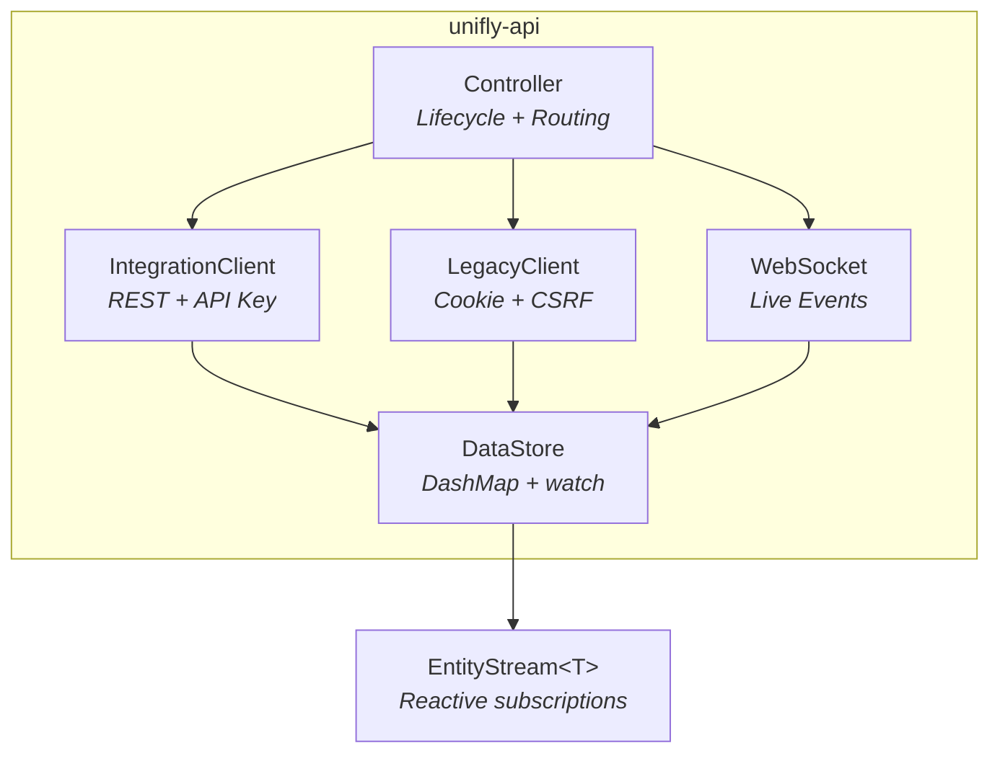

# Library (unifly-api)

[](https://crates.io/crates/unifly-api)
[](https://docs.rs/unifly-api)

The engine behind unifly is published independently on [crates.io](https://crates.io/crates/unifly-api). Use it to build your own UniFi tools, integrations, or automations in Rust.

## Quick Start

Add to your `Cargo.toml`:

```toml
[dependencies]
unifly-api = "0.8"
secrecy = "0.10"
tokio = { version = "1", features = ["full"] }
```

## Low-Level API Access

Talk directly to the controller for maximum control:

```rust
use unifly_api::{IntegrationClient, TransportConfig, TlsMode, ControllerPlatform};
use secrecy::SecretString;

#[tokio::main]
async fn main() -> Result<(), Box<dyn std::error::Error>> {
    let transport = TransportConfig::new(TlsMode::DangerAcceptInvalid);
    let client = IntegrationClient::from_api_key(
        "https://192.168.1.1",
        &SecretString::from("your-api-key"),
        &transport,
        ControllerPlatform::UnifiOs,
    )?;

    let devices = client.list_devices("default").await?;
    println!("Found {} devices", devices.len());
    Ok(())
}
```

## High-Level Controller

Reactive streams, automatic refresh, and dual-API data merging:

```rust
use unifly_api::{Controller, ControllerConfig, AuthCredentials, TlsVerification};
use secrecy::SecretString;

#[tokio::main]
async fn main() -> Result<(), Box<dyn std::error::Error>> {
    let config = ControllerConfig {
        base_url: "https://192.168.1.1".parse()?,
        auth: AuthCredentials::ApiKey(SecretString::from("your-api-key")),
        tls: TlsVerification::DangerAcceptInvalid,
        ..Default::default()
    };
    let controller = Controller::new(config);
    controller.connect().await?;

    // Reactive subscription: notified when data changes
    let devices = controller.devices().current();
    println!("Found {} devices", devices.len());

    // Subscribe to live updates
    let mut stream = controller.devices();
    loop {
        stream.changed().await?;
        let updated = stream.current();
        println!("Device count updated: {}", updated.len());
    }
}
```

## Architecture



| Type | Purpose |
|---|---|
| `Controller` | Main entry point. Wraps `Arc<ControllerInner>` for cheap cloning across async tasks |
| `DataStore` | Entity storage. `DashMap` + `watch` channels for lock-free reactive updates |
| `EntityStream<T>` | Reactive subscription. Call `current()` for a snapshot or `changed()` to await updates |
| `EntityId` | Dual-identity enum: `Uuid(Uuid)` for Integration API or `Legacy(String)` for Legacy API |
| `AuthCredentials` | Auth mode: `ApiKey`, `Credentials`, `Hybrid`, or `Cloud` variants |

## Connection Modes

| Mode | Use Case | Background Tasks |
|---|---|---|
| `Controller::connect()` | Long-lived (TUI, daemons) | Refresh loop (30s), WebSocket, command processor |
| `Controller::oneshot()` | Fire-and-forget (CLI) | None. Single fetch, then done |

## Full Documentation

See [docs.rs/unifly-api](https://docs.rs/unifly-api) for the complete API reference with all types, methods, and examples.
